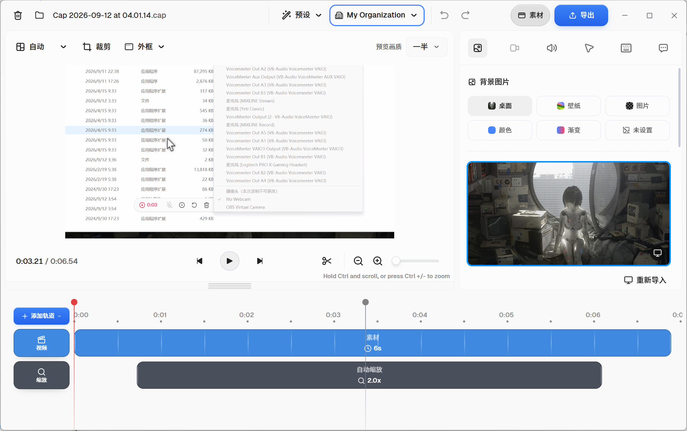
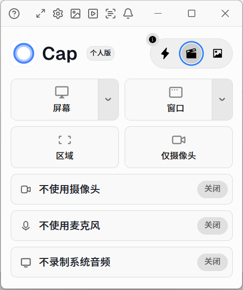
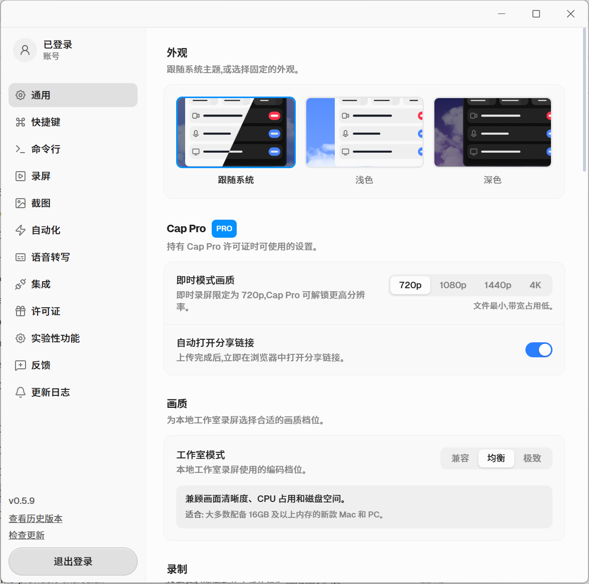

# Cap Chinese

基于 [Cap](https://github.com/CapSoftware/Cap) 的非官方简体中文适配项目，主要用于个人自用，同时公开译文、源码补丁和构建记录，方便有相同需求的人参考。

本项目不隶属于 Cap 官方，不提供官方签名、账号或会员授权，不修改付费判断。主要由个人按需维护，不承诺更新周期、兼容所有设备或提供商业支持。

## 当前版本

- 基于官方 `cap-v0.5.9`，提交 `c6b83804d2e9fa8757b75268e573b8ff113141bb`。
- 目标平台：Windows x64；其他平台尚未验证。
- 参考 [PingGai/Cap-Chinese](https://github.com/PingGai/Cap-Chinese) 的旧版汉化，并按 0.5.9 的界面和逻辑重新适配。感谢原作者和上游贡献者。

这是一个**汉化补丁与构建工作区**，不是完整的 Cap 源码镜像。Git 仓库不提交上游 checkout、node_modules、编译缓存、个人配置或运行包。完整改动见 [前端补丁](translations/desktop-0.5.9.patch) 和 [原生补丁](translations/native-0.5.9.patch)。

<table width="100%">
  <tr>
    <!-- 合并3列，整行放图1 -->
    <td colspan="3" align="center">
      
    </td>
  </tr>
  <tr>
    <!-- 下面一行两格：图2、图3 -->
    <td width="20%" align="center">
      
    </td>
    <td width="30%" align="center">
      
    </td>
  </tr>
</table>

## 汉化内容

覆盖主界面、设备与目标选择、首次引导、录制状态、提词器、视频编辑器、时间轴、字幕、导出、截图编辑器、设置子页，以及原生窗口标题、托盘菜单和系统通知。

品牌名、格式名、快捷键、设备名和用户内容保留原值；服务器返回的错误、在线页面、更新日志、部分底层错误与 CLI 帮助仍可能为英文。

相较旧参考版本，补充了截图编辑器、自动化、命令行、转写/字幕、多轨编辑等新增界面的中文文案。修改不替换底层录制算法，不绕过权限、授权或会员限制。

## 使用方法

下载Releases中的最新压缩包解压使用，如：

1. 完整解压 `0.5.9-zh-CN.zip`。
2. 在 `0.5.9-zh-CN` 目录中双击 `Cap Chinese.exe`。
3. 保留同目录全部 DLL、辅助程序和 `assets`；不要只复制 EXE，不要覆盖官方安装目录。

需要 [Microsoft Edge WebView2 Runtime](https://developer.microsoft.com/microsoft-edge/webview2/) 和可用的图形驱动。未签名不等于获得系统信任；请核验来源与哈希，不要关闭系统安全防护。

## 数据和账号

中文版默认使用独立标识 `so.cap.desktop.zh`：

- 配置和工程默认位于 `%APPDATA%\\so.cap.desktop.zh`。
- 日志位于 `%LOCALAPPDATA%\\so.cap.desktop.zh\\logs`。
- 不自动导入官方版账号、设置或录屏。解压运行不代表所有数据随程序目录移动。
- 不要同时运行官方版和中文版，以免竞争快捷键、摄像头等资源。
- 已有官方 `cap` 命令时，不要随意使用设置中的“安装/卸载命令行工具”，它可能影响 PATH 中的入口。

Cap 的在线登录、上传、分享和其他服务仍受相关服务条款约束。汉化不使应用自动离线，也不替你取得服务授权或取消上游隐私设置。

## 查看源码与构建

参见 [开发与补丁说明](docs/DEVELOPMENT.md)。两个完整补丁均针对上面的固定提交，前端补丁已经包含早期设置页改动，**不要再叠加 `settings-0.5.9.patch`**。

| 目录 | 内容 |
| --- | --- |
| `translations/` | 译文清单、完整前端/原生补丁；旧设置补丁仅供历史参考 |
| `config/` | 版本固定信息、公开环境模板、构建配置 |
| `scripts/` | 构建、汉化与打包检查；部分脚本依赖本地双工作树布局 |
| `licenses/` | 上游与参考项目的原始许可声明 |
| `docs/` | 构建、许可和发布说明；历史记录不代表当前验收结果 |

## 反馈与贡献

欢迎通过仓库 Issues 提交漏译、错译、界面截断和明确的复现步骤。请附版本、Windows 版本和经过遮盖的截图；不要上传完整配置、Token、账号资料、私人录屏或未经检查的日志。

小范围、单一主题的修正更容易合并。涉及文案时不要翻译枚举、后端命令、设备 ID 或快捷键值。贡献须保留原作者署名与适用许可，不要求转让著作权。

## 许可与致谢

本仓库新增的译文、补丁、脚本和文档（未另行标注者）按 **GNU AGPL v3.0 only** 发布，完整条款见 [LICENSE](LICENSE)，适用范围和第三方例外见 [许可说明](docs/LICENSING.md) 与 [NOTICE](NOTICE)。

上游 Cap 的 AGPLv3、指定 crate 的 MIT 许可及第三方原有许可继续有效。本项目不取得 Cap、FFmpeg、微软等商标或第三方组件的所有权。

“主要自用”只是维护定位，**不是禁止商用、分发或修改的附加条款**。软件在适用法律允许范围内按原样提供，不作保证；具体权利、义务和免责范围以适用许可证为准。
